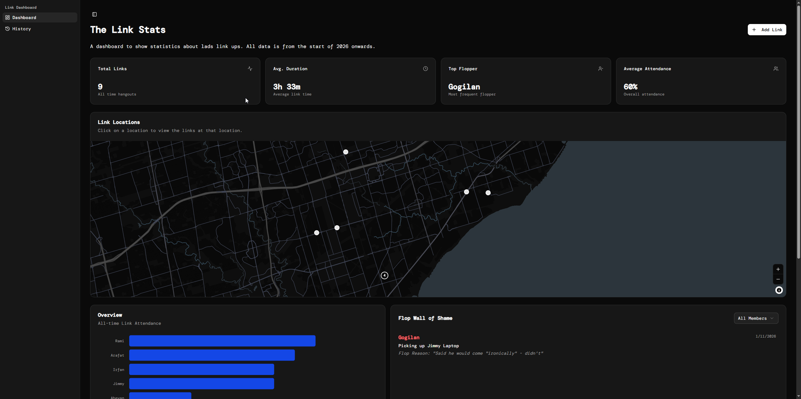
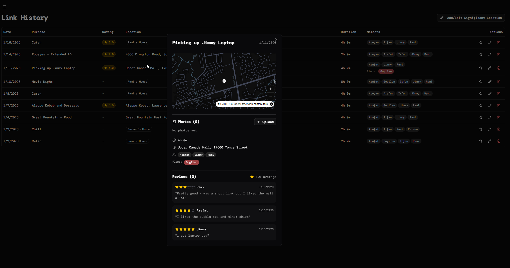

# linkstats

linkstats is a modern dashboard to help see statistics for when you and your friends have hung out. Just a fun project to familiarize myself with working with shadcn components, tailwind and supabase as a backend.

## Features

###  Interactive Dashboard
The dashboard contains multiple charts and graphs to help visualize the dat including all-time hangouts, average duration and special per-person awards.

### Location Mapping
-   **Interactive Map**: Visualize where hangouts occur on a dark-themed map.
-   **Significant Locations**:
    -   Custom labeling for frequent spots (e.g., "Rami's House" instead of the raw address).
    -   **Add/Edit/Delete**: Full management of these custom location aliases directly from the UI.
    -   **Badges**: Clean badges replace long addresses in history lists and map tooltips.

###  Link History & Management

-   **Comprehensive History**: sortable and filterable list of all past events.
-   **Easy Logging**: "Add Link" modal to quickly record a new hangout with:
    -   Date, Time, Duration
    -   Purpose/Activity
    -   Location (with auto-complete and map integration)
    -   Attendees & "Floppers" (those who bailed)
-   **Edit Capabilities**: Fully editable history to correct any details.
